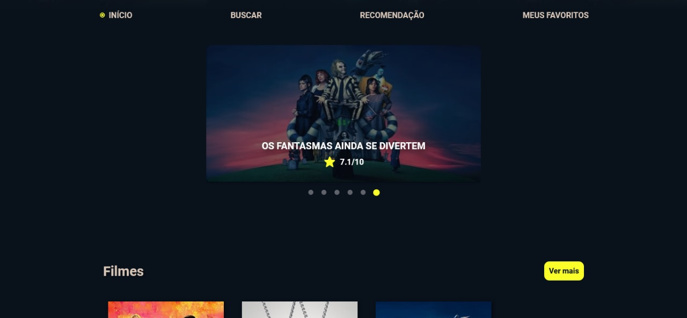
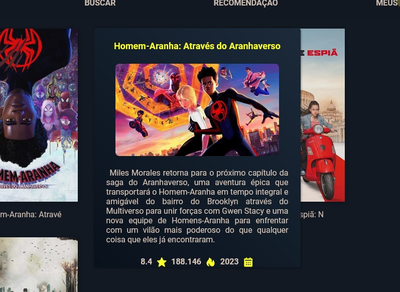
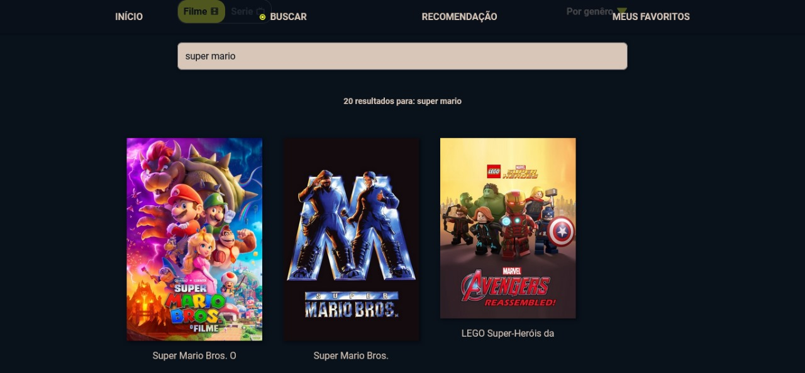
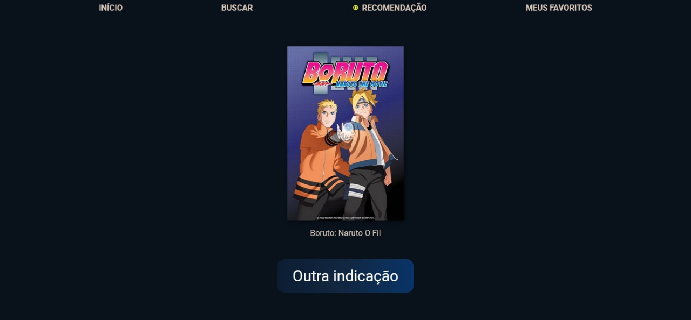
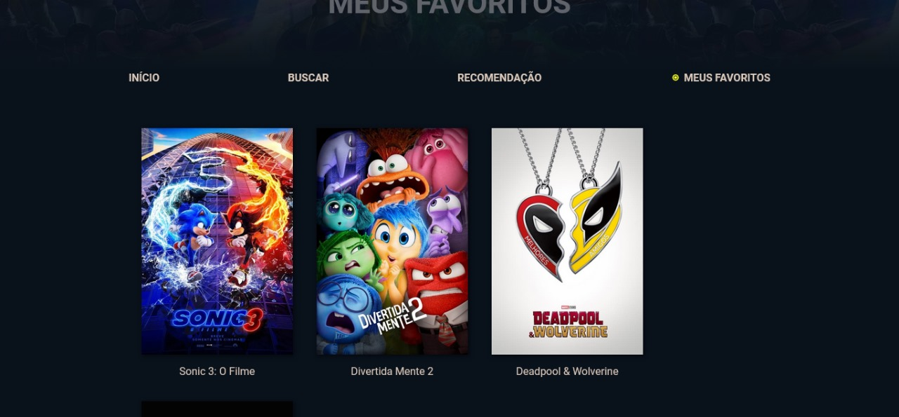

# DevMasters - Aplicação web sobre filmes e séries em conjunto com a API do TMDB

O projeto é um site de recomendações de filmes e séries, que apresenta 4 páginas com objetivos diferentes. <br>


🏠 <b>Inicio:</b> Página inicial do site onde mostra alguns dos filmes e séries mais famosos da atualidade.<br>
🔎 <b>Buscar:</b> Serve para buscar um filme e série que você deseje e ver a nota de avaliação dele e outras características.<br>
🎬 <b>Recomendação:</b> Filmes e séries são gerados aleatoriamente de nossas recomendações para o usuário assistir.<br>
❤️ <b>Meus favoritos:</b> Filmes e séries que o usuário se interessa e coloca nos favoritos para assistir posteriormente.


### Tecnologias ultilizadas


### Comunicação e interação com a API do TMDB

<b>Popularidade:</b>
<div style="background-color: black; border-radius: 10px;">

```javascript
fetch("https://api.themoviedb.org/3/TIPO/popular?api_key=CHAVE_API&language=pt-BR&page=PAGE")
```

</div>


<b>Busca:</b>
<div style="background-color: black; border-radius: 10px;">

```javascript
fetch("https://api.themoviedb.org/3/search/TIPO?api_key=CHAVE_API&query=NOME_BUSCA&language=pt-BR&page=PAGE")
```

</div>

<b>Busca por gênero:</b>
<div style="background-color: black; border-radius: 10px;">

```javascript
fetch("https://api.themoviedb.org/3/discover/TIPO?api_key=CHAVE_API&language=pt-BR&&with_genres=ID_GENERO&page=PAGE")
```

</div>

<b>Busca por séries e filmes aleatórios:</b> 
<div style="background-color: black; border-radius: 10px;">

```javascript
fetch("https://api.themoviedb.org/3/discover/TIPO?api_key=CHAVE_API&sort_by=popularity.desc&page=PAGINA&language=pt-BR")
```

</div>

### Imagens DevMasters

<div align="center">
    <div style="display: flex; flex-wrap: wrap; justify-content: center;">
        <div style="margin: 10px; text-align: center;">
            
            <p>Tela Inicial</p>
        </div>
        <div style="margin: 10px; text-align: center;">
            
            <p>Descrição</p>
        </div>
        <div style="margin: 10px; text-align: center;">
            
            <p>Busca</p>
        </div>
        <div style="margin: 10px; text-align: center;">
            
            <p>Recomendações</p>
        </div>
        <div style="margin: 10px; text-align: center;">
            
            <p>Meus Favoritos</p>
        </div>
    </div>
</div>